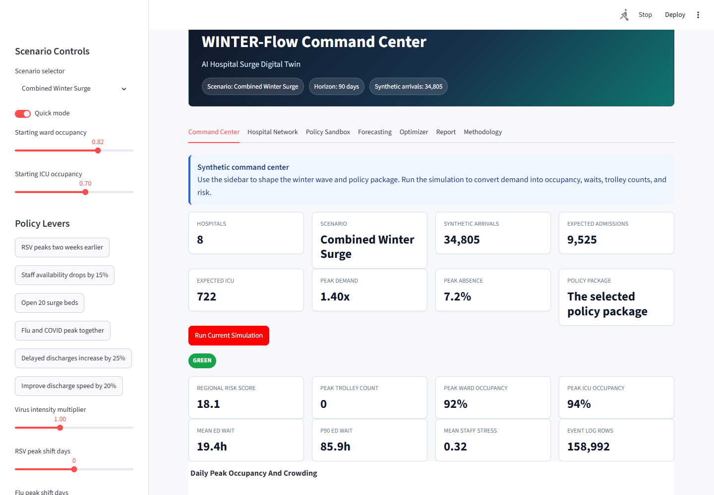
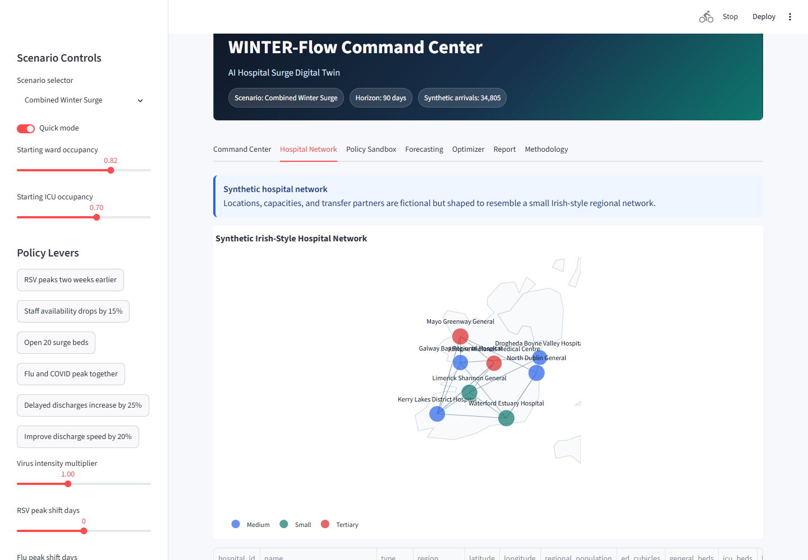
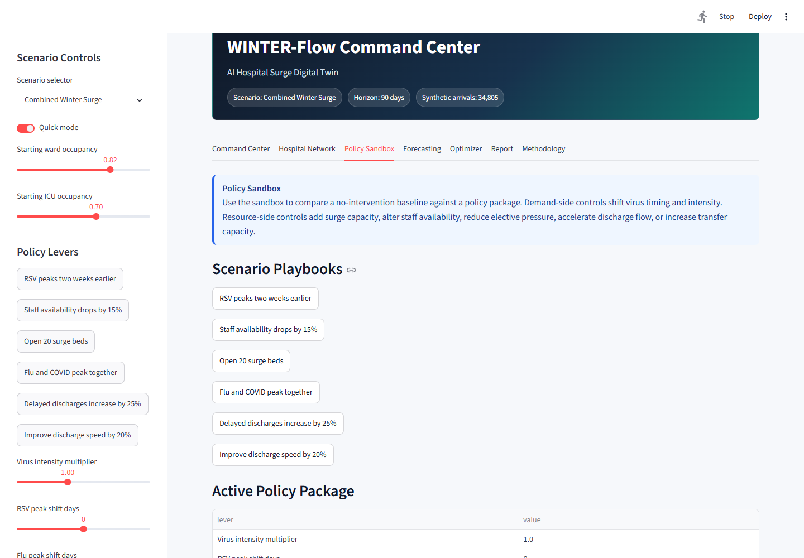
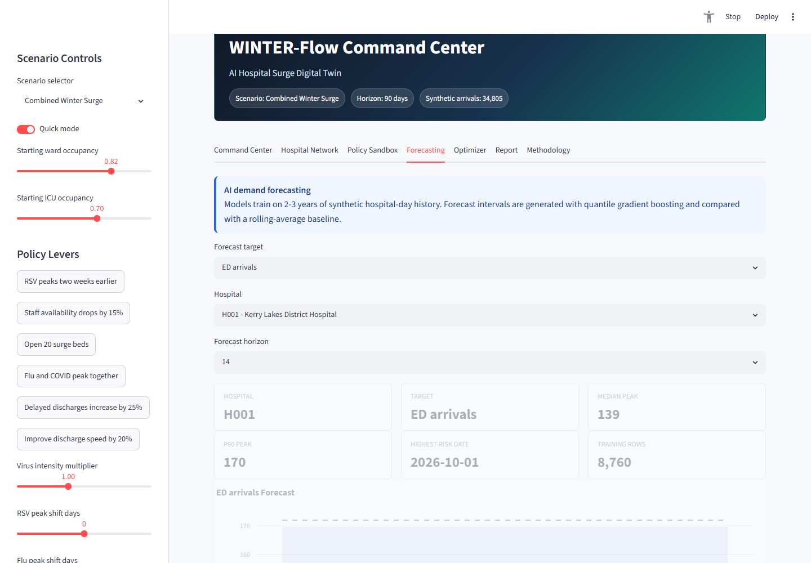
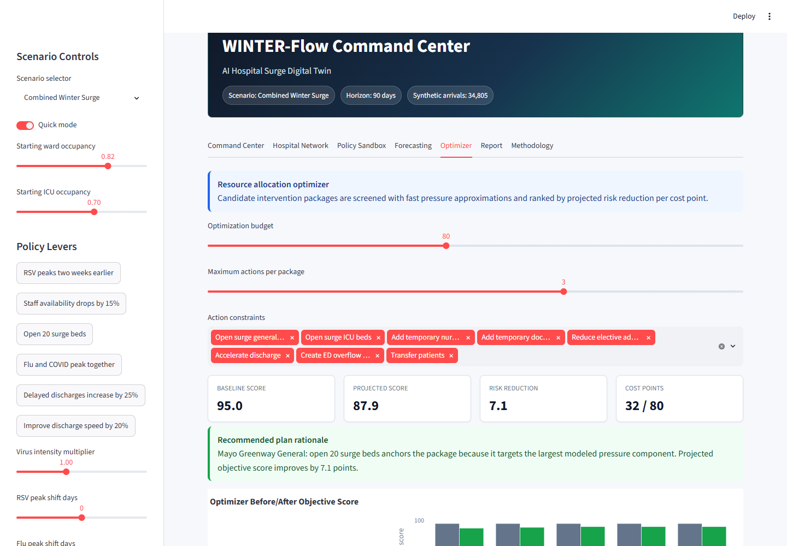
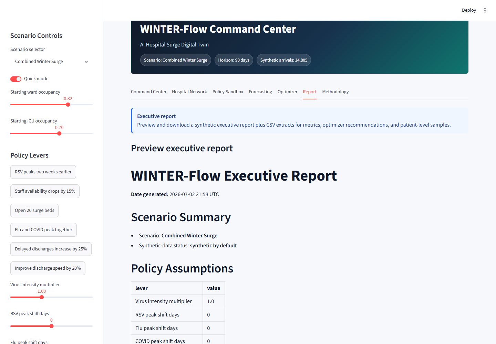
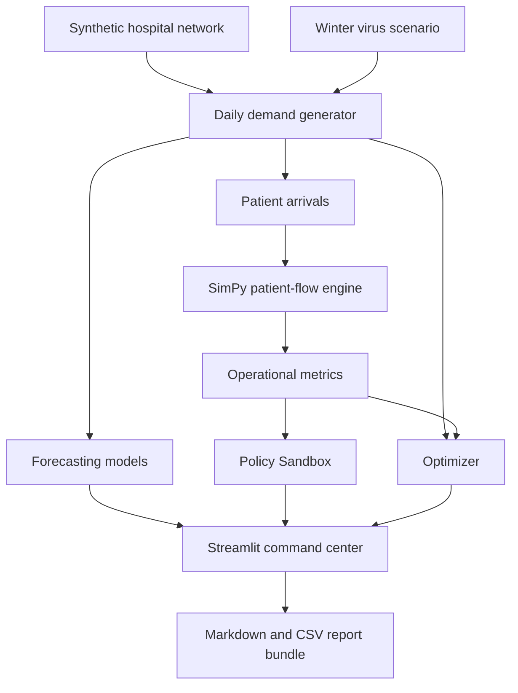

# WINTER-Flow: AI Hospital Surge Digital Twin

WINTER-Flow is a Python and Streamlit command-center application that models how winter respiratory virus waves can affect a synthetic hospital network. It combines deterministic synthetic data generation, discrete-event simulation, machine-learning forecasting, policy scenario comparison, optimization, and downloadable executive reporting.

This project uses synthetic data by default. It is not a clinical decision-support tool and should not be used for real hospital operations.


## Tech Stack

- Python
- Streamlit
- pandas
- NumPy
- scikit-learn
- SimPy
- Plotly
- pytest

## Screenshots

### Command Center



### Hospital Network



### Policy Sandbox



### Forecasting



### Optimizer



### Executive Report



## Problem Statement

Winter respiratory waves can create simultaneous pressure across emergency departments, inpatient beds, ICU capacity, staffing, delayed discharges, and inter-hospital transfers. WINTER-Flow models how a health-system command center might explore those pressures using reproducible synthetic data and transparent operational assumptions.

The goal is not to predict real clinical outcomes. The goal is to show how simulation, forecasting, and optimization can be composed into a practical planning workflow.

## Key Features

- Synthetic hospital network generator
- Winter virus scenario generator for influenza, RSV, COVID, combined surge, and severe combined surge
- Patient-level synthetic arrival generator with age, acuity, virus type, admission, ICU, length-of-stay, and discharge-delay fields
- SimPy discrete-event patient-flow simulation
- ED wait, trolley, occupancy, staff-stress, and risk metrics
- Policy Sandbox for before/after intervention comparisons
- ML forecasting with rolling baseline, quantile models, prediction intervals, evaluation metrics, and feature importance
- Candidate-search optimizer for resource allocation recommendations
- Downloadable Markdown and CSV executive report bundle
- pytest coverage for core modules

## Architecture



## Installation

```bash
cd winter-flow
python -m venv .venv
.venv\Scripts\activate
pip install -r requirements.txt
```

On macOS or Linux:

```bash
source .venv/bin/activate
pip install -r requirements.txt
```

## Usage

Run the Streamlit app:

```bash
streamlit run app.py
```

Run tests:

```bash
pytest
```

## Example Workflow

Use this workflow to exercise the main app features:

1. Choose `Severe Combined Surge` in the scenario selector.
2. Open the Command Center tab and run the baseline simulation.
3. Review risk labels, peak trolley count, ward occupancy, ICU occupancy, and ED wait KPIs.
4. Open the Policy Sandbox tab.
5. Apply discharge acceleration and open surge beds.
6. Run the before/after comparison and review the change in risk and trolley metrics.
7. Open the Optimizer tab and review the recommended intervention plan.
8. Open the Report tab and download the executive Markdown report.

## Methodology

WINTER-Flow uses deterministic seeded generation throughout:

- Hospital capacities, staffing, regions, and transfer relationships are fictional.
- Virus waves use seasonal Gaussian curves with seeded noise.
- Patient arrivals are sampled with Poisson demand, day-of-week effects, virus-specific severity, acuity, age group, admission probability, ICU probability, ED service time, inpatient length of stay, and discharge delay.
- Simulation uses SimPy with one simulation unit equal to one hour.
- Forecasting uses lag, rolling, calendar, scenario, and hospital features with rolling-average and quantile gradient boosting models.
- Optimization uses candidate intervention packages, fast objective approximations, and cost-aware ranking.

## Project Structure

```text
winterflow/
  data/           Synthetic hospital, virus, and patient-demand generation
  simulation/     SimPy patient-flow simulation modules
  forecasting/    Forecast features, models, and evaluation
  optimization/   Policy controls, candidate actions, objective, and optimizer
  reporting/      Markdown and CSV report bundle generation
  ui/             Streamlit theme, components, and Plotly visuals
  utils/          Shared helpers
tests/            pytest suite
data/             Synthetic and optional public-data folders
outputs/          Report and screenshot output folders
```

## Limitations

- All default data is synthetic.
- Risk scores and forecasts are simplified planning indicators.
- The optimizer uses approximate screening logic, not a validated operational model.
- The simulation is designed for synthetic scenario exploration, not production deployment.
- Real-world use would require governance, local calibration, clinical safety review, data protection review, and stakeholder validation.

## Future Extensions

- Add real public respiratory surveillance data as an optional input.
- Add calibrated hospital-specific arrival baselines.
- Add multi-objective optimization with explicit staffing rosters.
- Add PDF report export.
- Add scenario save/load.
- Add CI workflow and hosted deployment.

## Not A Clinical Tool

WINTER-Flow is not a clinical tool. It does not provide medical advice, diagnosis, treatment recommendations, or real operational guidance. All default data is synthetic, and outputs must not be used for patient-care decisions.
